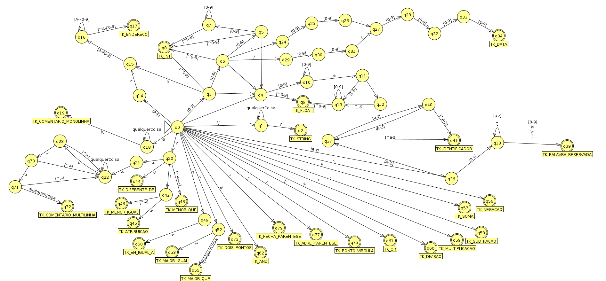

# Os estados e as transições

```txt
    O ESTADO q35 ESTÁ VAGO PARA SER USADO!!!
```

## O autômato que aqui está  explicado, é representado pela imagem abaixo:
- Resalvas:
  - No ramo da data, ao invés do simbolo `-`*(hífen)* considere o simbolo `_`*(underscore)*
  - Na imagem abaixo, a transição do Estado `q0` para o estado `q4` está incorreto, considere que há um estado a mais entre ambos que será especificado ao decorrer do texto



## Os Estados
- `q0`: estado inicial do autômato;
- `q1`: estado onde ocorre a leitura do dados do tipo String;
- `q2`: **estado de aceitação** para o tipo de dados String;
- `q3`: estado de decisão, onde são esperados os tokens `[0-9]` para o tipo de dado Inteiro, `.`*(ponto)* para o tipo de dados Ponto Flutuante, ou `x` para o tipo de dado Endereço;
- `q4`: estado onde ocorre a confirmação que o tipo de dado lido é Ponto Flutuante;
- `q5`: estado de decisão, onde são esperados os tokens `[0-9]` para a confirmação da leitura do dado de tipo inteiro, ou `.`*(ponto)* para a confirmação da leitura do tipo de dados Ponto Flutuante;
- `q6`: estado de decisão, onde são esperados os tokens \
  - `[0-9]` para a confirmação da leitura do dado de tipo inteiro,
  - `.`*(ponto)* para a confirmação da leitura do tipo de dados Ponto Flutuante,
  - `_`*(underscore) para a confirmação do tipo Data(dia_mês_ano)*,
  - ou `/`*(barra) para a confirmação do tipo Data(dia/mês/ano)*,
- `q7`: estado de leitura dos tokens do tipo de dado inteiro. A leitura tem tamanho indefinido e termina ao ler qualquer caractere não numérico;
- `q8`: **estado de aceitação** para o tipo de dados Inteiro;
- `q9`: **estado de aceitação** para o tipo de dados Ponto Flututante;
- `q10`: estado de leitura dos tokens do tipo de dado Ponto Flutuante. A leitura tem tamanho indefinido e termina ao ler o caractere `e`*(expoente)* ou algum caractere não numérico;
- `q11`: estado de decisão, onde são esperados os tokens `-`*(menos)* para a confirmação que o expoente é negativo, ou o token `[0-9]` para a confirmação que o expoente é positivo;
- `q12`: estado de espera pelo token `[0-9]`, pois o expoente negativo deve possuir ao menos um caractere numérico;
- `q13`: estado de leitura dos tokens de expoente do tipo de dado Ponto Flutuante. A leitura tem tamanho indefinido e termina ao ler o qualquer caractere não numérico;
- `q14`: estado de espera pelo token `[x]`*endereço hexadecimal* para a confirmação que o tipo de dado lido é do tipo Endereço;
- `q15`: estado de espera pelo token `[0-9]` para a confirmação que o tipo de dado lido é do tipo Endereço, pois um endereço hexadecimal deve possuir ao menos um caracterea após o token `x`;
- `q16`: estado de leitura dos tokens do tipo de dado Endereço. A leitura tem tamanho indefinido e termina ao ler o qualquer caractere que não esteja de acordo com esta expressão regular `[A-F0-9]`;
- `q17`: **estado de aceitação** para o tipo de dados Endereço;
- `q18`: estado de confirmação que a linha que será lida é um comentário monolinha;
- `q19`: **estado de aceitação** para o comentário monolinha;
- `q20`: estado de decisão onde são esperados os tokens \  
  - `<`*(menor que)*, um possível comentário multilinhas, para a transição do estado `q20` para o estado `q21`,
  - `>`*(maior que)* transição para o estado `q44`,
  - `=`*(igual)*, transição para o estado `q42`;
- `q21`: estado de espera por um token `<`*(menor que)* para a confirmação que está lendo lido um comentário multilinhas;
- `q22`: estado de confirmação do comentário multilinhas, esta estado também é um estado de leitura onde qualquer caractere diferente do token `>`*(maior que)* será tratado como comentário de forma absoluta;
- `q23`: estado de decisão, onde, após ter lido um token `>`*(maior que)* o próximo token pode decidir se o que foi lido é apenas uma parte do comentário, e será retornado ao `q22`, ou se o comentário está sendo finalizado, progredindo para o `q70`;
- `q24`: estado de espera por um token `[0-9]` para o primeiro digito do mês;
- `q25`: estado de espera por um token `[0-9]` para o segundo digito do mês;
- `q26`: estado de espera por um token `_`*(underscore)* para a separação entre os digitos de mês e ano;
- `q27`: estado de espera por um token `[0-9]` para o primeiro digito do ano;
- `q28`: estado de espera por um token `[0-9]` para o segundo digito do ano;
- `q29`: estado de espera por um token `[0-9]` para o primeiro digito do mês;
- `q30`: estado de espera por um token `[0-9]` para o segundo digito do mês;
- `q31`: estado de espera por um token `/`*(barra)* para a separação entre os digitos de mês e ano;
- `q32`: estado de espera por um token `[0-9]` para o terceiro digito do ano;
- `q33`: estado de espera por um token `[0-9]` para o quarto digito do ano;
- `q34`: **estado de aceitação** para o tipo de dados Data;
- `q35`:
- `q36`: estado de decisão onde são esperados os tokens `[a-z]` para a confirmação que será lida uma palavra reservada, ou o token `[A-Z]` para a confirmação que será lido um token identificador(nome de variável);
- `q37`: estado de decisão onde são esperados os tokens `[A-Z]` para o desenvolvimento do token identificador(nome de variável), se caso algo diferente disso for lido, será concluida a leitura do token identificador;
- `q38`