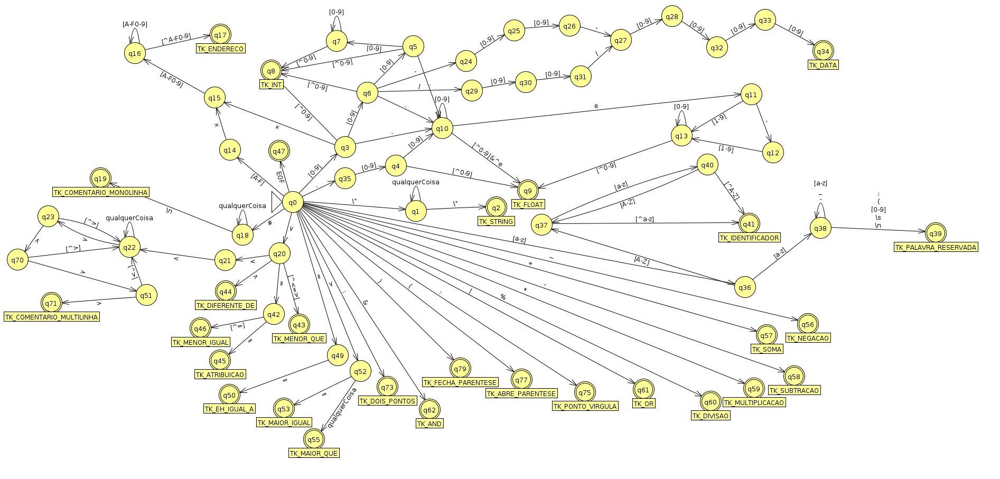

# Os estados e as transições

## Indice
- [Os estados e as transições](#os-estados-e-as-transições)
  - [Indice](#indice)
  - [Explicacao do automato:](#explicacao-do-automato)
  - [Versao desatualizada do automato](#versao-desatualizada-do-automato)
  - [Os Estados](#os-estados)
  - [As Transições](#as-transições)
  - [Versao atualizada do automato](#versao-atualizada-do-automato)

## Explicacao do automato:
- Resalvas:
  - No ramo da data, ao invés do simbolo `-`*(hífen)* considere o simbolo `_`*(underscore)*;
  - Na imagem abaixo, a transição do Estado `q0` para o estado `q4` está incorreto, considere que há um estado a mais entre ambos que será especificado ao decorrer do texto;
  - Desconsidere o estado q72, pois não é necessário a transição de q71 -> q72 para chegar ao estado de aceitação.  

## Versao desatualizada do automato

## Os Estados
- `q0`: estado inicial do autômato;
- `q1`: estado onde ocorre a leitura do dados do tipo String;
- `q2`: **estado de aceitação** para o tipo de dados String;
- `q3`: estado de decisão, onde são esperados os tokens `[0-9]` para o tipo de dado Inteiro, `.`*(ponto)* para o tipo de dados Ponto Flutuante, ou `x` para o tipo de dado Endereço;
- `q4`: estado onde ocorre a confirmação que o tipo de dado lido é Ponto Flutuante;
- `q5`: estado de decisão, onde são esperados os tokens `[0-9]` para a confirmação da leitura do dado de tipo inteiro, ou `.`*(ponto)* para a confirmação da leitura do tipo de dados Ponto Flutuante;
- `q6`: estado de decisão, onde são esperados os tokens \
  - `[0-9]` para a confirmação da leitura do dado de tipo inteiro,
  - `.`*(ponto)* para a confirmação da leitura do tipo de dados Ponto Flutuante,
  - `_`*(underscore) para a confirmação do tipo Data(dia_mês_ano)*,
  - ou `/`*(barra) para a confirmação do tipo Data(dia/mês/ano)*,
- `q7`: estado de leitura dos tokens do tipo de dado inteiro. A leitura tem tamanho indefinido e termina ao ler qualquer caractere não numérico;
- `q8`: **estado de aceitação** para o tipo de dados Inteiro;
- `q9`: **estado de aceitação** para o tipo de dados Ponto Flututante;
- `q10`: estado de leitura dos tokens do tipo de dado Ponto Flutuante. A leitura tem tamanho indefinido e termina ao ler o caractere `e`*(expoente)* ou algum caractere não numérico;
- `q11`: estado de decisão, onde são esperados os tokens `-`*(menos)* para a confirmação que o expoente é negativo, ou o token `[0-9]` para a confirmação que o expoente é positivo;
- `q12`: estado de espera pelo token `[0-9]`, pois o expoente negativo deve possuir ao menos um caractere numérico;
- `q13`: estado de leitura dos tokens de expoente do tipo de dado Ponto Flutuante. A leitura tem tamanho indefinido e termina ao ler o qualquer caractere não numérico;
- `q14`: estado de espera pelo token `[x]`*endereço hexadecimal* para a confirmação que o tipo de dado lido é do tipo Endereço;
- `q15`: estado de espera pelo token `[0-9]` para a confirmação que o tipo de dado lido é do tipo Endereço, pois um endereço hexadecimal deve possuir ao menos um caracterea após o token `x`;
- `q16`: estado de leitura dos tokens do tipo de dado Endereço. A leitura tem tamanho indefinido e termina ao ler o qualquer caractere que não esteja de acordo com esta expressão regular `[A-F0-9]`;
- `q17`: **estado de aceitação** para o tipo de dados Endereço;
- `q18`: estado de confirmação que a linha que será lida é um comentário monolinha;
- `q19`: **estado de aceitação** para o comentário monolinha;
- `q20`: estado de decisão onde são esperados os tokens \  
  - `<`*(menor que)*, um possível comentário multilinhas, para a transição do estado `q20` para o estado `q21`,
  - `>`*(maior que)* transição para o estado `q44`,
  - `=`*(igual)*, transição para o estado `q42`;
- `q21`: estado de espera por um token `<`*(menor que)* para a confirmação que está lendo lido um comentário multilinhas;
- `q22`: estado de confirmação do comentário multilinhas, esta estado também é um estado de leitura onde qualquer caractere diferente do token `>`*(maior que)* será tratado como comentário de forma absoluta;
- `q23`: estado de decisão, onde, após ter lido um token `>`*(maior que)* o próximo token pode decidir se o que foi lido é apenas uma parte do comentário, e será retornado ao `q22`, ou se o comentário está sendo finalizado, progredindo para o `q70`;
- `q24`: estado de espera por um token `[0-9]` para o primeiro digito do mês;
- `q25`: estado de espera por um token `[0-9]` para o segundo digito do mês;
- `q26`: estado de espera por um token `_`*(underscore)* para a separação entre os digitos de mês e ano;
- `q27`: estado de espera por um token `[0-9]` para o primeiro digito do ano;
- `q28`: estado de espera por um token `[0-9]` para o segundo digito do ano;
- `q29`: estado de espera por um token `[0-9]` para o primeiro digito do mês;
- `q30`: estado de espera por um token `[0-9]` para o segundo digito do mês;
- `q31`: estado de espera por um token `/`*(barra)* para a separação entre os digitos de mês e ano;
- `q32`: estado de espera por um token `[0-9]` para o terceiro digito do ano;
- `q33`: estado de espera por um token `[0-9]` para o quarto digito do ano;
- `q34`: **estado de aceitação** para o tipo de dados Data;
- `q35`:
- `q36`: estado de decisão onde são esperados os tokens `[a-z]` para a confirmação que será lida uma palavra reservada, ou o token `[A-Z]` para a confirmação que será lido um token identificador(nome de variável);
- `q37`: estado de decisão onde são esperados os tokens `[A-Z]` para o desenvolvimento do token identificador(nome de variável), se caso algo diferente disso for lido, será concluida a leitura do token identificador;
- `q38`: estado de leitura dos tokens do tipo de dado Palavra Reservada. A leitura tem tamanho indefinido e termina ao ler o qualquer caractere que não seja um letra minúscula;
- `q39`: **estado de aceitação** para o tipo de dados Palavra Reservada;
- `q40`: estado de decisão onde são esperados os tokens `[A-Z]` para a formação do dado do tipo Identificador*(variável)* e será realizada a transição para o estado `q37`. Se qualquer outro caractere for lido, será então realizada a transição para o estado `q41`;
- `q41`: **estado de aceitação** para o tipo de dados Identificador;
- `q42`: estado de decisão onde é esperado o token `=`*(igual)* para ser realizado a transição para o estado `q45`, caso qualquer outro caractere seja lido, será realizada a transição para o estado `q46`;
- `q43`: **estado de aceitação** para o token `TK_MENOR_QUE`;
- `q44`: **estado de aceitação** para o token `TK_DIFERENTE_DE`;
- `q45`: **estado de aceitação** para o token `TK_ATRIBUICAO`;
- `q46`: **estado de aceitação** para o token `TK_MENOR_IGUAL`;
- `q47`: **estado de aceitação** para o token `EOF`, ou seja, finaliza toda a execução do autômato;
- `q48`: **não existe**;
- `q49`: estado de espera pelo token `=`*(igual)*. Caso seja lido, será realizada a transição para o estado `q50`;
- `q50`: **estado de aceitação** para o token `TK_EH_IGUAL_A`;
- `q51`: **não existe**;
- `q52`: estado de decisão onde é esperado o token `=`*(igual)* para realizar a transição para o estado `q53`. Caso qualquer outro token seja lido, será realizada a transição para o estado `q55`;
- `q53`: **estado de aceitação** para o token `TK_MAIOR_IGUAL`;
- `q54`: **não existe**;
- `q55`: **estado de aceitação** para o token `TK_MAIOR_QUE`;
- `q56`: **estado de aceitação** para o token `TK_NEGACAO`;
- `q57`: **estado de aceitação** para o token `TK_SOMA`;
- `q58`: **estado de aceitação** para o token `TK_SUBTRACAO`;
- `q59`: **estado de aceitação** para o token `TK_MULTIPLICACAO`;
- `q60`: **estado de aceitação** para o token `TK_DIVISAO`;
- `q61`: **estado de aceitação** para o token `TK_OR`;
- `q62`: **estado de aceitação** para o token `TK_AND`;
- `q63`: **não existe**;
- `q64`: **não existe**;
- `q65`: **não existe**;
- `q66`: **não existe**;
- `q67`: **não existe**;
- `q68`: **não existe**;
- `q69`: **não existe**;
- `q70`: estado de decisão, onde, após ter lido dois tokens `>`*(maior que)* o próximo token pode decidir se o que foi lido é apenas uma parte do comentário, e será retornado ao `q22`, ou se o comentário está sendo finalizado, progredindo para o `q71`;
- `q71`: **estado de aceitação** para o comentário monolinha;
- `q72`: **não existe**;
- `q73`: **estado de aceitação** para o token `TK_DOIS_PONTOS`;
- `q74`: **não existe**;
- `q75`: **estado de aceitação** para o token `TK_PONTO_VIRGULA`;
- `q76`: **não existe**;
- `q77`: **estado de aceitação** para o token `TK_ABRE_PARENTESE`;
- `q78`: **não existe**;
- `q79`: **estado de aceitação** para o token `TK_FECHA_PARENTESE`.

## As Transições
- `q0` -> `q1`: leitura do caractere `"`;
- `q0` -> `q3`: leitura de um caractere da expressão regular `[0-9]`;
- `q0` -> `q14`: leitura de um caractere da expressão regular `[A-F]`;
- `q0` -> `q18`: leitura do caractere `#`*(tralha)*;
- `q0` -> `q20`: leitura do caractere `<`*(menor que)*;
- `q0` -> `q35`: leitura do caractere `.`*(ponto)*;
- `q0` -> `q36`: leitura do caractere `#`*(tralha)*;
- `q0` -> `q47`: leitura do caractere `EOF`*(Fim do Arquivo - End Of File)*;
- `q0` -> `q49`: leitura de um caractere da expressão regular `[a-z]`;
- `q0` -> `q52`: leitura do caractere `>`*(maior que)*;
- `q0` -> `q56`: leitura do caractere `~`*(til)*;
- `q0` -> `q57`: leitura do caractere `+`*(mais)*;
- `q0` -> `q58`: leitura do caractere `-`*(menos)*;
- `q0` -> `q59`: leitura do caractere `*`*(asterisco)*;
- `q0` -> `q60`: leitura do caractere `%`*(porcentagem)*;
- `q0` -> `q61`: leitura do caractere `|`*(pipe)*;
- `q0` -> `q62`: leitura do caractere `&`*(E comercial)*;
- `q0` -> `q73`: leitura do caractere `:`*(dois pontos)*;
- `q0` -> `q75`: leitura do caractere `;`*(ponto e vírgula)*;
- `q0` -> `q77`: leitura do caractere `(`*(abre parêntese)*;
- `q0` -> `q79`: leitura do caractere `)`*(fecha parêntese)*;
- `q1` -> `q1`: leitura de qualquer caractere que não seja `"`;
- `q1` -> `q2`: leitura do caractere `"`;
- `q3` -> `q10`: leitura do caractere `.`*(ponto)*;
- `q3` -> `q6`: leitura de um caractere da expressão regular `[0-9]`;
- `q3` -> `q8`: leitura de um caractere que não seja `x`, ou `.`*(ponto)* e não está contido na expressão regular `[0-9]`; 
- `q3` -> `q15`: leitura do caractere `x`;
- `q4` -> `q9`: leitura de um caractere que não esteja contido na expressão regular `[0-9]`;
- `q4` -> `q10`: leitura de um caractere da expressão regular `[0-9]`;
- `q5` -> `q10`: leitura do caractere `.`*(ponto)*;
- `q5` -> `q7`: leitura de um caractere da expressão regular `[0-9]`;
- `q5` -> `q8`: leitura de um caractere diferente de `.`*(ponto)* e que também não esteja contido na expressão regular `[0-9]`;
- `q6` -> `q10`: leitura do caractere `.`*(ponto)*;
- `q6` -> `q5`: leitura de um caractere da expressão regular `[0-9]`;
- `q6` -> `q8`: leitura de um caractere que não seja `.`*(ponto)*, `_`*(underscore)*, ou `/`*(barra)* e que também não esteja contido na expressão regular `[0-9]`; 
- `q6` -> `q24`: leitura do caractere `_`*(underscore)*;
- `q6` -> `q29`: leitura do caractere `/`*(barra)*;
- `q7` -> `q7`: leitura de um caractere da expressão regular `[0-9]`;
- `q7` -> `q8`: leitura de um caractere que não esteja contido na expressão regular `[0-9]`;
- `q10` -> `q9`: leitura de um caractere que não seja o caractere `e`, e também não esteja contido na expressão regular `[0-9]`;
- `q10` -> `q10`: leitura de um caractere da expressão regular `[0-9]`;
- `q10` -> `q11`: leitura do caractere `e`;
- `q11` -> `q12`: leitura do caractere `-`*(menos)*;
- `q11` -> `q13`: leitura de um caractere da expressão regular `[1-9]`;
- `q12` -> `q13`: leitura de um caractere da expressão regular `[1-9]`;
- `q13` -> `q9`: leitura de um caractere que não esteja contido na expressão regular `[0-9]`;
- `q13` -> `q13`: leitura de um caractere da expressão regular `[0-9]`;
- `q14` -> `q15`: leitura do caractere `x`;
- `q15` -> `q16`: leitura de um caractere da expressão regular `[A-F0-9]`;
- `q16` -> `q16`: leitura de um caractere da expressão regular `[A-F0-9]`;
- `q15` -> `q17`: leitura de um caractere que não esteja contido na expressão regular `[A-F0-9]`;
- `q18` -> `q19`: leitura do caractere `\n`*(nova linha)*;
- `q20` -> `q21`: leitura do caractere `<`*(menor que)*;
- `q20` -> `q42`: leitura do caractere `>`*(maior que)*;
- `q20` -> `q43`: leitura de um caractere que não seja `<`*(menor que)*, `>`*(maior que)* ou `=`*(igual)*; 
- `q20` -> `q44`: leitura do caractere `=`*(igual)*;
- `q21` -> `q22`: leitura do caractere `<`*(menor que)*;
- `q22` -> `q22`: leitura qualquer caractere que não seja `>`*(maior que)*;
- `q22` -> `q23`: leitura do caractere `>`*(maior que)*;
- `q23` -> `q22`: leitura qualquer caractere que não seja `>`*(maior que)*;
- `q23` -> `q70`: leitura do caractere `>`*(maior que)*;
- `q24` -> `q25`: leitura de um caractere da expressão regular `[0-9]`;
- `q25` -> `q26`: leitura de um caractere da expressão regular `[0-9]`;
- `q26` -> `q27`: leitura do caractere `_`*(underscore)*;
- `q27` -> `q28`: leitura de um caractere da expressão regular `[0-9]`;
- `q28` -> `q32`: leitura de um caractere da expressão regular `[0-9]`;
- `q29` -> `q30`: leitura de um caractere da expressão regular `[0-9]`;
- `q30` -> `q31`: leitura de um caractere da expressão regular `[0-9]`;
- `q31` -> `q27`: leitura do caractere `/`*(barra)*;
- `q32` -> `q33`: leitura de um caractere da expressão regular `[0-9]`;
- `q33` -> `q34`: leitura de um caractere da expressão regular `[0-9]`;
- `q35` -> `q4`: leitura de um caractere da expressão regular `[0-9]`;
- `q36` -> `q37`: leitura de um caractere da expressão regular `[A-Z]`;
- `q36` -> `q38`: leitura de um caractere da expressão regular `[a-z]`;
- `q37` -> `q40`: leitura de um caractere da expressão regular `[a-z]`;
- `q37` -> `q41`: leitura de um caractere que não esteja contido na expressão regular `[a-z]`;
- `q38` -> `q38`: leitura de um caractere da expressão regular `[a-z]`;
- `q38` -> `q39`: leitura de um caractere que não esteja contido na expressão regular `[a-z]`;
- `q40` -> `q37`: leitura de um caractere da expressão regular `[A-Z]`;
- `q40` -> `q41`: leitura de um caractere que não esteja contido na expressão regular `[A-Z]`;
- `q42` -> `q45`: leitura do caractere `=`*(igual)*;
- `q42` -> `q46`: leitura de qualquer caractere que não seja o caractere `=`*(igual)*;
- `q49` -> `q50`: leitura do caractere `=`*(igual)*;
- `q52` -> `q53`: leitura do caractere `=`*(igual)*;
- `q52` -> `q55`: leitura de qualquer caractere que não seja o caractere `=`*(igual)*;
- `q70` -> `q22`: leitura qualquer caractere que não seja `>`*(maior que)*;
- `q70` -> `q71`: leitura do caractere `>`*(maior que)*;

## Versao atualizada do automato

